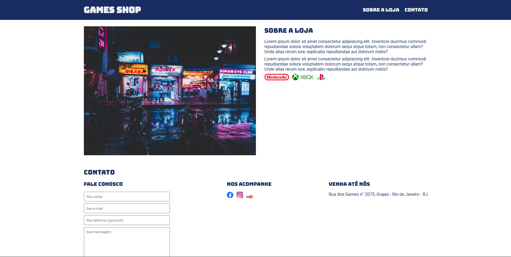

## 🎮 Games Shop - Página Inicial  

[🇺🇸 English Version](https://github.com/gabrielcamarate/site_gamesshop/README.md) | [🇧🇷 Versão em Português]([#-games-shop---página-inicial](https://github.com/gabrielcamarate/site_gamesshop/PT-BR-README.md))

---

  

Uma landing page para uma loja fictícia de games, desenvolvida como exercício de **HTML** e **CSS**.  

## 📋 Índice  

- [📌 Sobre o Projeto](#-sobre-o-projeto)  
- [🚀 Tecnologias Utilizadas](#-tecnologias-utilizadas)  
- [💻 Como Executar](#-como-executar)  
- [📷 Imagens e Design](#-imagens-e-design)  
- [📬 Contato](#-contato)  
- [📜 Licença](#-licença)  

---

## 📌 Sobre o Projeto  

O **Games Shop** é um projeto de landing page desenvolvido para treinar **HTML e CSS**. Ele apresenta uma loja de games fictícia, exibindo informações sobre a empresa, os produtos vendidos e formas de contato.  

### 🔹 Recursos principais:  

✅ Design responsivo e moderno.  
✅ Links para redes sociais.  
✅ Formulário de contato.  
✅ Seção sobre a loja com imagens das principais marcas.  

---

## 🚀 Tecnologias Utilizadas  

O projeto foi construído utilizando as seguintes tecnologias:  

- **HTML5**  
- **CSS3**  
- **Google Fonts** (Bungee e Roboto)  

---

## 💻 Como Executar  

1️⃣ Clone o repositório:  
```bash
git clone https://github.com/seu-usuario/games-shop.git
```
2️⃣ Acesse a pasta do projeto:  
```bash
cd games-shop
```
3️⃣ Abra o arquivo `index.html` em seu navegador.  

> 📌 **Dica**: Você pode usar a extensão **Live Server** no VSCode para visualizar as alterações em tempo real.  

---

## 📷 Imagens e Design  

O projeto usa imagens de marcas famosas do mercado de games, incluindo:  

- **Nintendo Switch**  
- **Xbox Series X**  
- **PlayStation 5**  

Além disso, os ícones das redes sociais foram incluídos para melhorar a experiência do usuário.  

---

## 📬 Contato  

📍 **Endereço:** Rua dos Games n° 2075, Grajaú - Rio de Janeiro - RJ  

📧 **E-mail:** contato@gameshop.com.br  

🌐 **Redes Sociais:**  
[Facebook](#) | [Instagram](#) | [YouTube](#)  

---

## 📜 Licença  

Este projeto foi desenvolvido apenas para fins educacionais e não possui licença comercial.  

---

🕹️ **Desenvolvido como um exercício de HTML e CSS**  
